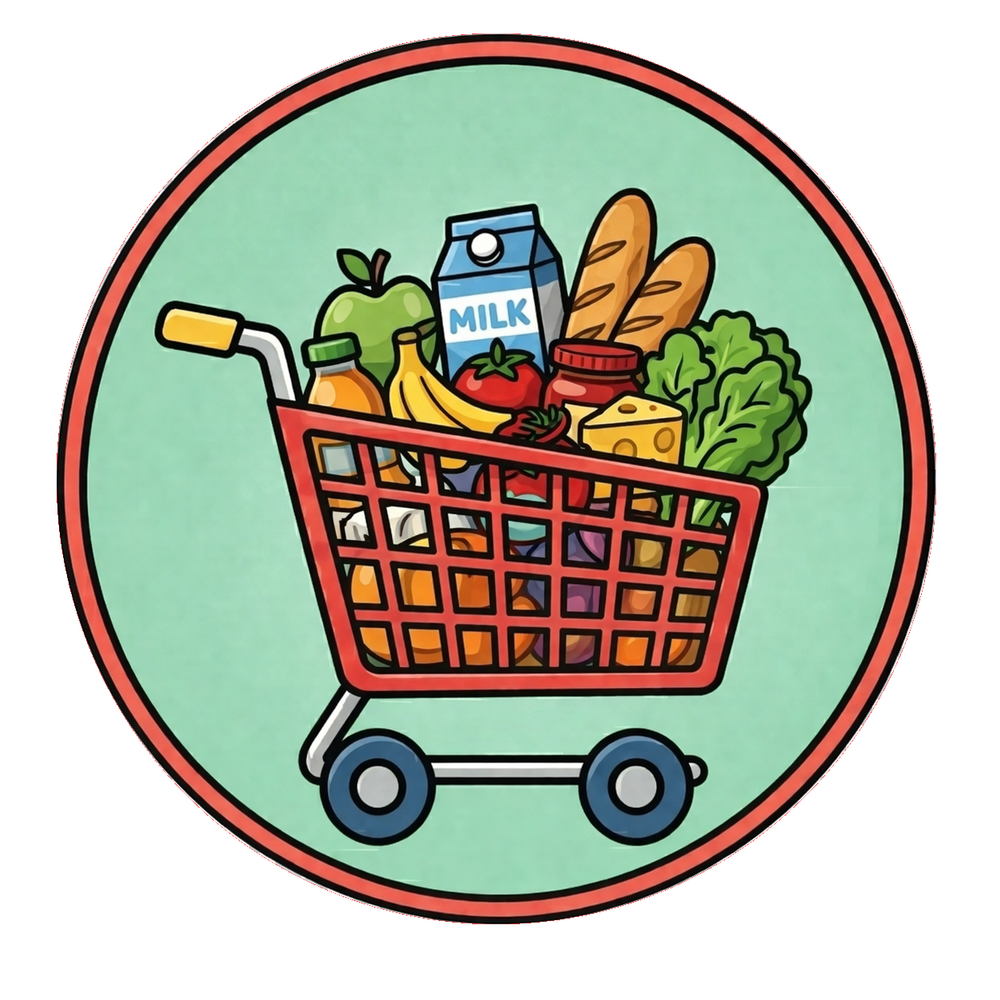
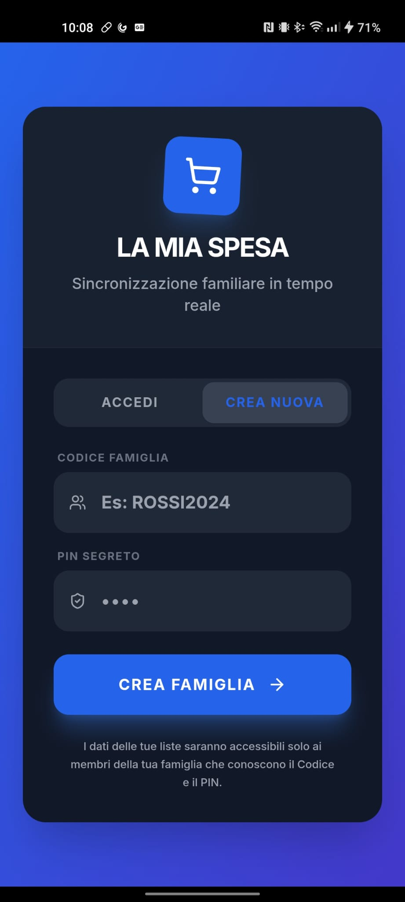
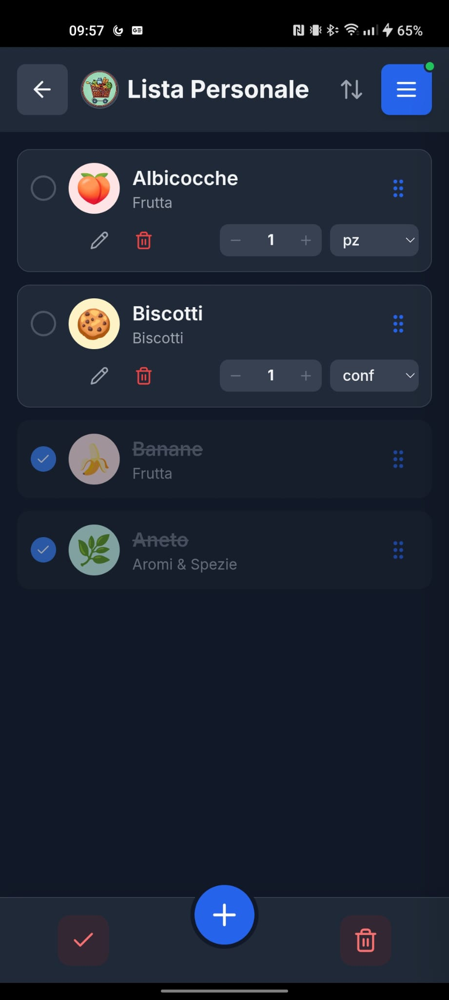
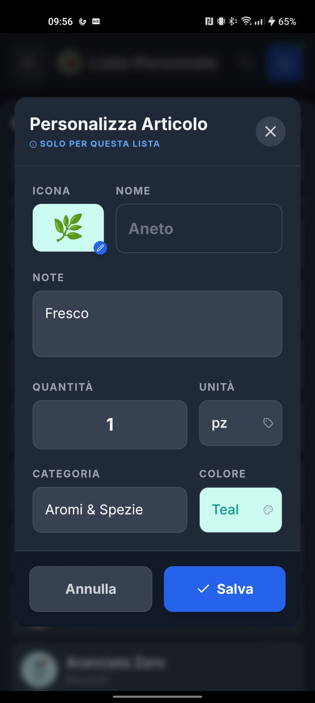
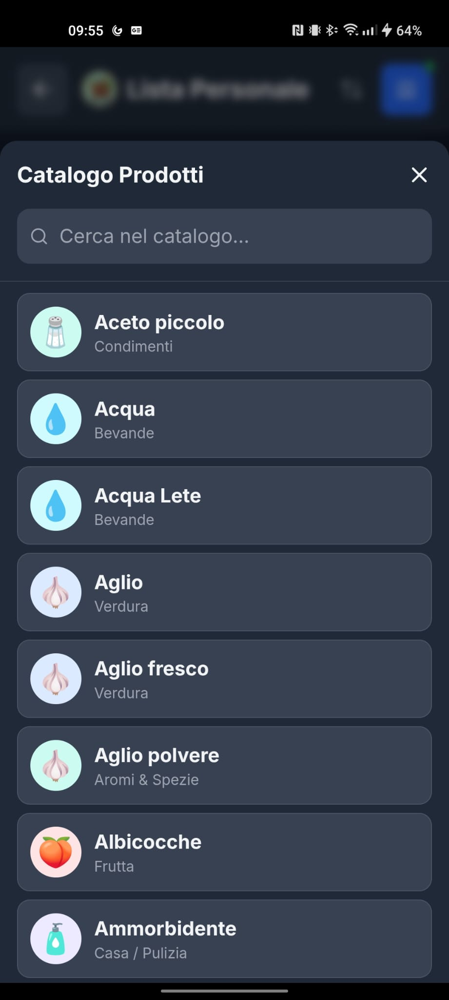
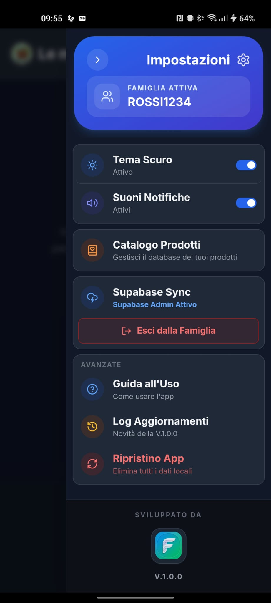
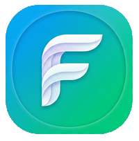

  

# La Mia Spesa 🛒✨

**La Mia Spesa** è un'applicazione mobile moderna (PWA) progettata per semplificare la gestione della spesa quotidiana, sia per uso personale che collaborativo all'interno di un nucleo familiare. 

Grazie alla tecnologia cloud in tempo reale, ogni membro della famiglia può aggiungere, spuntare o modificare prodotti contemporaneamente, vedendo i cambiamenti degli altri istantaneamente sul proprio schermo.

---

## 📸 Screenshot dell'App

  
  
  

  
  
  

---

## 🌟 Caratteristiche Principali

### 👨‍👩‍👧‍👦 Collaborazione Familiare
*   **Accesso Privato**: Ogni famiglia ha un proprio **Codice Famiglia** e un **PIN** di sicurezza per isolare i propri dati.
*   **Sincronizzazione Realtime**: Spunta un prodotto e apparirà sbarrato sul telefono di tua moglie/marito in meno di un secondo.
*   **Lavoro di Squadra**: Più persone possono modificare la stessa lista contemporaneamente senza blocchi o conflitti.

### 📝 Gestione Liste Intelligente
*   **Liste Locali e Cloud**: Crea liste private salvate solo sul tuo telefono o condividile con la famiglia con un semplice tocco sulla nuvoletta.
*   **Snapshot (Copia)**: Puoi creare una copia locale istantanea di una lista condivisa per usarla come base per i tuoi appunti privati.
*   **Ordinamento Personalizzato**: Ordina i prodotti alfabeticamente, per categoria o manualmente (tramite trascinamento nelle liste locali).

### 🛒 Catalogo Prodotti e AI
*   **Autocompletamento**: Un vasto catalogo di prodotti pronti all'uso con icone ed emoji predefinite.
*   **Intelligenza Artificiale**: L'app classifica automaticamente i nuovi prodotti che aggiungi nella categoria corretta.
*   **Personalizzazione**: Cambia icone, categorie e aggiungi note specifiche (es. marca o variante) per ogni singolo acquisto.

### 📱 Esperienza d'uso Moderna
*   **Fluidità Estrema**: Sistema di trascinamento prodotti (Drag & Drop) ottimizzato per essere veloce e piacevole anche su liste lunghe.
*   **Tema Scuro/Chiaro**: Interfaccia che si adatta alle tue preferenze visive o alle impostazioni di sistema.
*   **Supporto Offline**: Continua a usare l'app anche in un garage senza campo; le modifiche verranno inviate al cloud non appena tornerà la connessione.

---

## 🛠 Note Tecniche (Sintesi)
L'applicazione è sviluppata con **React** e **TypeScript**, utilizzando **Capacitor** per il funzionamento su Android. Il "motore" del database è affidato a **Supabase (PostgreSQL)** per garantire sicurezza e velocità nel cloud.

---

## 🚀 Versione 1.1.0

  Sviluppato con ❤️ da F.  
  

